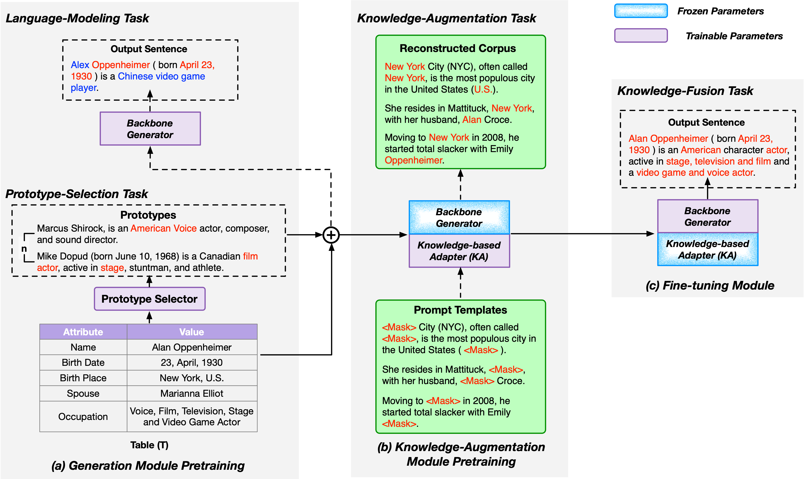

# AKG (Adapting Knowledge for Few-shot Table-to-Text Generation)
Authors: Zhixin Guo, Mingxuan Yan, Jiexing Qi, Jianping Zhou, Ziwei He, Guanjie Zheng, Xinbing Wang, and Chenghu Zhou

Code for IEEE/ACM Transactions on Audio, Speech and Language Processing 2024 Paper "Adapting Knowledge for Few-shot Table-to-Text Generation" https://arxiv.org/abs/2302.12468

## Requirements
```
pip install -r requirements.txt
```

For the evaluation with gpt3.5 turbo, you need to install the openai python package and test with your own API key. The code in this repo is thoroughly tested on our machine with a single NVIDIA GeForce RTX 3090 GPU.

## Project Structure


We propose a modularized pretraining strategy that targets AKG. The pretraining strategy consists of three modules: (a) Generation Module, (b) Knowledge-Augmentation Module, and (c) Fine-tuning Module. Throughout the generation module pretraining process, we divide the generation module into two tasks: a prototype-selection task and a language-modeling task. The prototype-selection task selects related prototypes to guide the generation of PLMs, and the language-modeling task employs a PLM as the backbone generator to generate fluent sentences. We pretrain these two tasks separately. We insert the Knowledge-based Adapter (KA) after the final layer of each encoder and decoder and adapt the generated prompt templates through the KA during the pretraining of the knowledge-augmentation module. All the parameters except those of the KA are frozen when pretraining the knowledge-augmentation module. The knowledge-augmentation module brings at least two benefits: (1) it enables us to use the large amounts of unlabeled domain-specific knowledge fully, which can alleviate the PLM’s inherent shortcomings of lacking domain knowledge; and (2) it allows us to design various tasks to employ the domain-specific knowledge. Finally, we fine-tune the pretrained modularized model on three data sets: Humans, Books, and Songs. Throughout the fine-tuning process, the parameters of the KA are frozen to retain the learned knowledge pretrained from the knowledge-augmentation module. The red text indicates the tabular data supporting the fact, and the blue text indicates that the (incorrect) fact conflicts with the information in the original table.


## Data
1. We use the Fewshot-NLG dataset for pretraining & testing the module. You can download the dataset from [here](https://webnlg-challenge.loria.fr/challenge_2017/).
2. For the unlabelled corpus, we followed the utilization of P2G. You can download the dataset from [here](https://github.com/yxuansu/Few-Shot-Table-to-Text-Generation).


## Acknowledgement
We thank [Zhouhan Lin](https://github.com/hantek), [Zhiyu Chen](https://github.com/czyssrs), and [Junxian He](https://github.com/jxhe) for their valuable advice. [Guanjie Zheng](https://jhc.sjtu.edu.cn/~gjzheng/) is the corresponding author of this paper. We acknowledge the financial support of the Ministry of Science and technology of the People’s Republic China grant #2022YFB3904200 and National Science Foundation of China grant #42050105, #61960206002, #62020106005, #62032020, #62061146002, #62272301.

## Citation
If you find this code useful, please consider citing our paper:
```
@article{guo2024adapting,
  title={Adapting Knowledge for Few-shot Table-to-Text Generation},
  author={Guo, Zhixin and Yan, Mingxuan and Qi, Jiexing and Zhou, Jianping and He, Ziwei and Zheng, Guanjie and Wang, Xinbing and Zhou, Chenghu},
  journal={IEEE/ACM Transactions on Audio, Speech, and Language Processing},
  year={2024},
  publisher={IEEE},
  doi={10.1109/TASLP.2024.3430480}
}
```